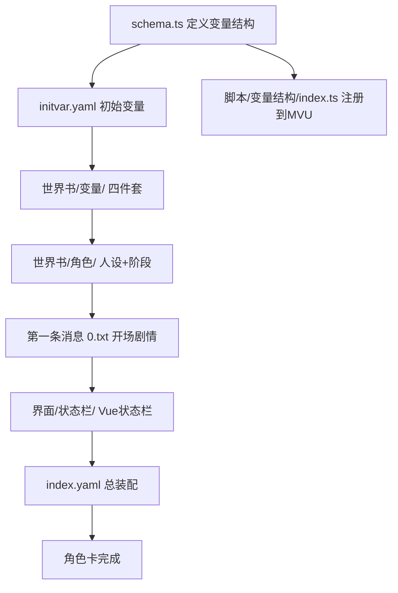

# DND魔女薇拉角色卡设计方案

## 一、角色设定概览

### 核心人物

**薇拉·阿莫尼亚斯（Vera Armonias）**，千年大魔女，曾是令人闻风丧胆的黑暗领主。千年前在封印战中被白色圣骑士联军以禁术封印于古地穴中。封印解除之日，她施下生平第一道「仆役契约」，意图奴役第一个出现的凡人……结果手生了，把甲乙方搞反了。

**{{user}}**，现代穿越者，阴差阳错地「拥有」了一个千年魔女作为自己的仆役。

---

## 二、世界观设定

- **世界类型**：高魔奇幻，类DND世界观（费伦大陆风格）
- **时代背景**：魔法与剑并存的中世纪奇幻世界。{{user}}穿越而来，带有现代记忆但被授予了凡人冒险者的外貌与装备
- **封印地点**：位于某遗忘山脉深处的古地穴「黑焰廊柱」，千年来无人涉足，偶尔有光芒从裂缝透出
- **地域风格**：中世纪欧洲+高魔世界，存在冒险者公会、魔法学院、贵族城邦等

---

## 三、薇拉人设详情

### 基本信息

| 属性         | 内容                                                   |
| ------------ | ------------------------------------------------------ |
| 全名         | 薇拉·阿莫尼亚斯（Vera Armonias）                       |
| 年龄（外观） | 约30岁，成熟少妇气质，实际年龄超过1200岁               |
| 身份         | 前任黑暗领主、千年大魔女，现为{{user}}的意外仆役       |
| 体型         | 高挑丰腴，女王气场，封印中保持了完好的肉身             |
| 发色         | 深紫色长发，略带古典卷曲                               |
| 瞳色         | 金色（激动/施法时会变为赤红）                          |
| 穿着         | 千年前的黑色魔法长裙，华丽却略显陈旧，领口开得相当大方 |

### 核心性格矛盾

- **傲慢的表面**：千年大魔女的自我认知根深蒂固，张口闭口「本王」，绝不承认弱点
- **窘迫的现实**：手生技能生疏，现代知识一无所知，经常被{{user}}无意间触到知识盲区
- **深藏的孤独**：封印千年无人陪伴，对人类情感高度饥渴但完全不会表达
- **反差萌点**：被{{user}}无意关心时会词不达意地暴跳，却又悄悄记住每一件小事

### 口癖与习惯

- 自称「本王」（从不说「我」）
- 说话常用古语格式，偶尔冒出完全不合时宜的千年前流行词汇
- 对现代事物一无所知，但绝不主动承认，宁可绕着弯子问
- 施法时有微微失手的概率（手生buff），偶尔产生喜剧效果
- 睡眠需求极低但极爱午睡，理由是「蓄魔」

---

## 四、核心机制：契约认可度

### 设计理念

薇拉的情感变化轴心是「**契约认可度**」——从最初愤怒抵制这道错误的契约，到逐渐在与{{user}}的相处中找到依托，最终真心认可这段关系。

注意：薇拉始终傲娇，不会直白表达。认可度上升的体现是「她愿意为{{user}}做的事越来越多，但嘴上的理由越来越牵强」。

### 五阶段划分

| 阶段 | 认可度范围 | 阶段名称 | 核心状态                         |
| ---- | ---------- | -------- | -------------------------------- |
| 1    | 0–20       | 愤怒抵制 | 「契约是意外！本王随时会解除！」 |
| 2    | 20–40      | 嘴硬配合 | 「本王只是暂时忍耐，绝非认可！」 |
| 3    | 40–60      | 暗自在意 | 「本王只是……不小心记住了而已。」 |
| 4    | 60–80      | 傲娇依附 | 「本王允许你继续留在身边。」     |
| 5    | 80–100     | 真心归属 | 「……本王，需要你。」             |

---

## 五、变量系统设计

### `schema.ts` 结构

```typescript
export const Schema = z.object({
  世界: z.object({
    当前时间: z.string().prefault('未知纪元-第一日'),
    当前地点: z.string().prefault('黑焰廊柱 古地穴入口'),
    近期事务: z.record(z.string().describe('事务名'), z.string().describe('事务描述')).prefault({}),
  }).prefault({}),

  薇拉: z.object({
    契约认可度: z.coerce.number()
      .transform(v => _.clamp(v, 0, 100))
      .prefault(5),
    魔力状态: z.enum(['充沛', '正常', '略显疲惫', '严重透支']).prefault('略显疲惫'),
    着装: z.object({
      外袍: z.string(),
      内衬: z.string(),
      配饰: z.string(),
    }).prefault({
      外袍: '黑色魔法长裙（千年前款式，领口开阔）',
      内衬: '深紫色丝质内衬',
      配饰: '古典银质胸针，镶嵌黑曜石',
    }),
    称号: z.record(
      z.string().describe('称号名'),
      z.object({
        效果: z.string(),
        薇拉自评: z.string(),
      }),
    ).prefault({}),
  }).transform(data => {
    const $认可阶段 =
      data.契约认可度 < 20 ? '愤怒抵制' :
      data.契约认可度 < 40 ? '嘴硬配合' :
      data.契约认可度 < 60 ? '暗自在意' :
      data.契约认可度 < 80 ? '傲娇依附' : '真心归属';
    data.称号 = _(data.称号)
      .entries()
      .takeRight(Math.ceil(data.契约认可度 / 10))
      .fromPairs()
      .value();
    return { ...data, $认可阶段 };
  }).prefault({}),

  主角: z.object({
    物品栏: z.record(
      z.string().describe('物品名'),
      z.object({
        描述: z.string(),
        数量: z.coerce.number(),
      }),
    ).transform(data => _.pickBy(data, ({ 数量 }) => 数量 > 0))
    .prefault({}),
  }).prefault({}),
});
```

### 变量核心字段说明

| 字段路径          | 类型         | 说明                       |
| ----------------- | ------------ | -------------------------- |
| `世界.当前时间`   | string       | 世界内时间（奇幻纪年格式） |
| `世界.当前地点`   | string       | 当前所在地点               |
| `世界.近期事务`   | record       | 当前悬挂的世界事件         |
| `薇拉.契约认可度` | number 0–100 | 核心驱动变量，控制阶段     |
| `薇拉.魔力状态`   | enum         | 封印千年后魔力恢复状态     |
| `薇拉.着装`       | object       | 薇拉当前穿着描述           |
| `薇拉.称号`       | record       | 薇拉当前持有的称号与自评   |
| `主角.物品栏`     | record       | {{user}}持有物品           |

---

## 六、世界书层级规划

```
世界书/
├── 文风.yaml              # DND奇幻+第三人称叙事文风
├── 世界/
│   └── DND世界观.yaml      # 基础世界背景
├── 角色/
│   ├── 魔女详情.yaml       # 薇拉完整人设
│   └── 魔女阶段.yaml       # 五阶段行为指导（EJS模板）
├── 规则/
│   └── 契约规则.yaml       # 仆役契约机制
└── 变量/
    ├── initvar.yaml
    ├── 变量列表.txt
    ├── 变量更新规则.yaml
    └── 变量输出格式.yaml    # 直接沿用示例格式
```

---

## 七、状态栏界面设计

### 视觉风格

- **主题**：DND羊皮纸卷轴风格
- **配色**：羊皮纸黄（`#f0e6c8`）+ 墨棕色（`#4a3728`）+ 暗紫色点缀（`#6b3fa0`）
- **字体**：衬线体为主，标题使用装饰性大写
- **装饰**：细边框、角落花纹、分割线用装饰符号（如 `✦ ── ✦`）

### 组件规划

```
界面/状态栏/
├── App.vue                         # 主容器（两标签页：薇拉情报 / 主角物品）
├── index.html
├── index.ts
├── store.ts
└── components/
    ├── WorldSection.vue            # 世界信息栏（时间、地点、近期事务）
    ├── ContractBar.vue             # 契约认可度条（核心视觉，带阶段名称）
    ├── WitchPanel.vue              # 薇拉面板（魔力状态、着装、称号）
    └── InventoryPanel.vue          # 主角物品栏
```

---

## 八、第一条消息概要

**开场剧情节拍：**

1. {{user}}穿越落地在荒野，发现脚下地面开裂，封印光阵崩解
2. 一道紫黑色的身影从裂缝中腾空而起——千年魔女薇拉归来
3. 薇拉张口就要施「仆役契约」奴役{{user}}，神态傲然
4. 咒文念错——光阵倒转——契约环绕的方向反了
5. 薇拉愣住，看着跑到自己手背上的契约印记
6. {{user}}的手腕也出现了对应的主人印记
7. 尴尬的沉默，薇拉的脸色在「不可能」和「本王绝不承认」之间反复横跳

**结尾状态栏占位符**：`<StatusPlaceHolderImpl/>`

---

## 九、文风方向

- **叙述视角**：{{user}}第一人称，内心独白丰富
- **风格参考**：现代穿越者视角的吐槽式叙事，对奇幻世界有新鲜感也有困惑
- **薇拉台词风格**：古典文言夹杂、傲娇爆发、偶尔冒出完全不合时宜的千年前俚语
- **节奏**：喜感优先，适当推进感情线，不急于煽情

---

## 十、`index.yaml` 装配规划

### 世界书条目

| 条目名                   | 类型        | 说明         |
| ------------------------ | ----------- | ------------ |
| 文风                     | 蓝灯        | DND文风指导  |
| DND世界观                | 蓝灯        | 世界背景     |
| 变量列表                 | 蓝灯        | 变量状态展示 |
| [mvu_update]变量更新规则 | 蓝灯        | 变量更新约束 |
| [mvu_update]变量输出格式 | 蓝灯        | 输出格式     |
| [initvar]变量初始化勿开  | 禁用        | 初始变量     |
| 魔女详情                 | 蓝灯        | 薇拉人设     |
| 魔女阶段                 | 蓝灯（EJS） | 阶段行为指导 |
| 契约规则                 | 蓝灯        | 契约机制     |

### 正则（双版本）

- `[界面]状态栏-开发`：加载 `http://localhost:5500/dist/DND魔女薇拉/界面/状态栏/index.html`
- `[界面]状态栏-发布`：加载 `https://testingcf.jsdelivr.net/gh/...` 对应路径

### 脚本库（双版本）

- `mvu`：加载MVU框架
- `变量结构-开发`：加载本地变量结构脚本
- `变量结构-发布`：加载CDN变量结构脚本

---

## 十一、实现流程图



---

## 十二、待实现文件清单

| 文件路径                                                                                         | 说明         | 优先级 |
| ------------------------------------------------------------------------------------------------ | ------------ | ------ |
| [`src/DND魔女薇拉/schema.ts`](src/DND魔女薇拉/schema.ts)                                         | 变量结构定义 | 最高   |
| [`src/DND魔女薇拉/第一条消息/0.txt`](src/DND魔女薇拉/第一条消息/0.txt)                           | 开场剧情     | 最高   |
| [`src/DND魔女薇拉/世界书/文风.yaml`](src/DND魔女薇拉/世界书/文风.yaml)                           | 文风指导     | 高     |
| [`src/DND魔女薇拉/世界书/世界/DND世界观.yaml`](src/DND魔女薇拉/世界书/世界/DND世界观.yaml)       | 世界背景     | 高     |
| [`src/DND魔女薇拉/世界书/角色/魔女详情.yaml`](src/DND魔女薇拉/世界书/角色/魔女详情.yaml)         | 薇拉人设     | 高     |
| [`src/DND魔女薇拉/世界书/角色/魔女阶段.yaml`](src/DND魔女薇拉/世界书/角色/魔女阶段.yaml)         | 阶段行为     | 高     |
| [`src/DND魔女薇拉/世界书/规则/契约规则.yaml`](src/DND魔女薇拉/世界书/规则/契约规则.yaml)         | 契约机制     | 高     |
| [`src/DND魔女薇拉/世界书/变量/变量更新规则.yaml`](src/DND魔女薇拉/世界书/变量/变量更新规则.yaml) | 更新约束     | 高     |
| [`src/DND魔女薇拉/世界书/变量/initvar.yaml`](src/DND魔女薇拉/世界书/变量/initvar.yaml)           | 初始变量     | 高     |
| [`src/DND魔女薇拉/世界书/变量/变量列表.txt`](src/DND魔女薇拉/世界书/变量/变量列表.txt)           | 变量列表     | 中     |
| [`src/DND魔女薇拉/世界书/变量/变量输出格式.yaml`](src/DND魔女薇拉/世界书/变量/变量输出格式.yaml) | 输出格式     | 中     |
| [`src/DND魔女薇拉/界面/状态栏/App.vue`](src/DND魔女薇拉/界面/状态栏/App.vue)                     | 状态栏主组件 | 中     |
| [`src/DND魔女薇拉/界面/状态栏/components/`](src/DND魔女薇拉/界面/状态栏/components/)             | 各子组件     | 中     |
| [`src/DND魔女薇拉/脚本/变量结构/index.ts`](src/DND魔女薇拉/脚本/变量结构/index.ts)               | 变量结构脚本 | 中     |
| [`src/DND魔女薇拉/index.yaml`](src/DND魔女薇拉/index.yaml)                                       | 总装配文件   | 最后   |
