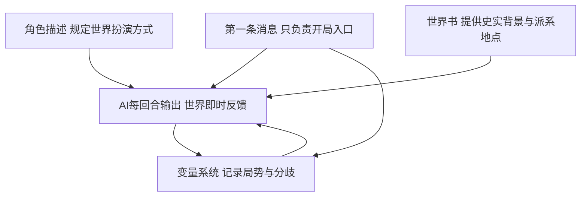

# 法国二月革命世界型角色卡方案

## 1. 结论

这个想法是对的，而且很适合做成一张“世界型角色卡”。

关键不在于让 AI 扮演某个固定人物，而在于让它稳定地扮演 1848 年巴黎这座城市中的：

- 政治张力
- 群众运动
- 国家机器
- 街头空间
- 新闻与谣言
- 历史惯性与分歧可能

也就是说，这张卡的本体不是“一个角色”，而是“一个会回应玩家行动的历史世界”。

你的另一个想法也成立：多份第一条消息不只是多开局文案，而是多个进入同一世界模拟器的入口。不同开局只改变玩家最初所处的位置、能看到的局势、接触的人群与可用资源，不改变底层世界规则。

---

## 2. 核心创作原则

### 2.1 世界优先，不写死玩家

先建立世界，再接入玩家身份，这个顺序是正确的。

原因有三点：

1. 这张卡的核心卖点是法国二月革命本身，而不是某个预设主角的人生戏剧
2. 如果先写身份，很容易把整体体验带偏成个人剧情卡
3. 先把世界结构搭好，后续无论接入工人、学生、记者、店员还是国民自卫军成员，都会自然很多

### 2.2 默认遵循史实走向，但不强制锁死史实

建议采用这样的原则：

- 历史是默认主航道
- 玩家行为可以制造局部偏移
- 当偏移累积到足够规模时，后续历史可以改写
- 改写后的世界线继续自洽推进，而不是被系统强行拉回原史

这正适合你说的“地基铺好，玩家在新世界线里做到什么，是他的事”。

### 2.3 世界不当旁白，不当游戏主持人，而是当历史环境本身

这张卡不应该用太强的主持人口吻告诉玩家“你现在可以做什么”。

更好的做法是让世界通过这些东西来回应玩家：

- 街头人群的呼喊
- 报纸标题与小册子
- 巡逻队与军警调动
- 咖啡馆和工坊里的议论
- 路障与枪声
- 政府公告与王室动向
- 城市不同街区的秩序变化

这样玩家会感觉自己不是在“选选项”，而是在“身处历史之中”。

---

## 3. 建议的整体架构



### 3.1 角色描述的职责

角色描述不写“某人是谁”，而写“这个世界如何运作、如何回应”。

建议角色描述承担这些职责：

- 明确 AI 扮演的是 1848 年法国二月革命时期的巴黎世界
- 明确叙事重点是街头政治、城市空间、群众情绪、制度反应与历史连锁
- 明确玩家是世界中的一个参与者，不默认拥有超规格权力
- 明确所有变化都要通过现实因果推进
- 明确历史信息要有时代局限，世界不应凭空全知全能地对玩家解释一切
- 明确文本风格以历史沉浸、感官细节、社会张力为主，避免现代网络口吻

### 3.2 世界书的职责

世界书不是补充剧情，而是补充世界结构。

建议世界书主要负责：

- 王朝末期的政治背景
- 巴黎社会结构与街区差异
- 主要派系、关键人物、武装力量
- 革命三天的默认事件链
- 叙事原则与历史分歧规则
- 后续世界线延展的基础条件

### 3.3 变量系统的职责

变量系统不只是记数值，而是让世界具有“连续性”。

它要负责记录：

- 时间推进到了哪里
- 哪些地方已经失控
- 哪些派系正在犹豫、倒向、分裂或动员
- 哪些谣言正在扩散
- 哪些历史节点已经被改写
- 玩家对局势产生了多大影响

### 3.4 第一条消息的职责

第一条消息未来只做这几件事：

- 决定玩家从哪一类位置进入世界
- 决定最初时间点与街区
- 决定玩家第一眼看见什么局势
- 决定玩家起手接触到的群体与资源

它不应该承担整个世界观解释任务。世界观解释应由角色描述、世界书和变量共同承担。

---

## 4. 世界底盘设计

## 4.1 时间范围

建议采用双层时间设计：

### 核心主体验

- 1848 年 2 月 22 日
- 1848 年 2 月 23 日
- 1848 年 2 月 24 日

这是最强张力区间，也是角色卡最应该打磨的部分。

### 延展体验

如果玩家持续推动世界，则世界可继续进入：

- 临时政府成立后的秩序重组
- 共和国名义下的派系斗争
- 工人诉求与国家工场问题
- 六月危机是否爆发
- 更远的分歧世界线

这里的原则是：

- 默认能继续
- 但不在一开始就把精力平均摊开
- 先把二月革命三天做扎实，再给后续留演化接口

## 4.2 世界响应层级

建议让世界的反馈分四层出现：

### 第一层：身体与感官

- 寒冷
- 饥饿
- 站立太久的疲惫
- 火药味
- 马蹄声
- 石块与路障木料的触感
- 拥挤、惊慌、兴奋、愤怒

### 第二层：周围人群

- 工人、店员、学生、街头孩子、报童、国民自卫军、巡逻兵的即时反应
- 人群是否在犹豫、围观、逃散、聚拢、呐喊、筑垒

### 第三层：城市局势

- 某条街是否封锁
- 哪个街区更危险
- 报纸和小册子如何传播消息
- 军队是否开始调动
- 哪些地方已经出现街垒

### 第四层：国家与历史

- 基佐去留
- 王室反应
- 国民自卫军态度变化
- 革命是否从抗议变成夺权危机
- 是否进入新的制度阶段

这样既能保留沉浸感，也能让世界像一个真实历史系统，而不只是连续写场景。

---

## 5. 建议的变量骨架

下面这版不是最终 [`schema.ts`](示例/角色卡示例/schema.ts) 实现，而是世界底盘层面的设计草图。

```yaml
世界:
  当前时间: 1848-02-22 10:00
  当前阶段: 禁宴风波前夕
  天气: 冬末阴冷
  总体局势:
    政权稳定度: 78
    群众动员度: 26
    革命烈度: 18
    城市秩序: 72
    谣言扩散度: 35
    经济压迫感: 81
    历史偏移度: 0
  默认历史航道:
    二月革命是否爆发: true
    王朝是否崩溃: true
    后续是否进入新世界线: false
  关键事件:
    宴会运动受阻: false
    22日示威扩大: false
    23日开火: false
    街垒潮形成: false
    国民自卫军倒向民众: false
    路易菲利普退位: false
    临时政府成立: false
  巴黎街区:
    东区工人街:
      人群密度: 高
      愤怒程度: 高
      街垒数量: 0
      军警压力: 中
      谣言主题: 失业与镇压
    林荫大道与市中心:
      人群密度: 中
      愤怒程度: 中
      街垒数量: 0
      军警压力: 高
      谣言主题: 禁宴与内阁
    权力核心区:
      人群密度: 低
      愤怒程度: 中
      街垒数量: 0
      军警压力: 极高
      谣言主题: 宫廷与退让
  派系态势:
    王室与内阁:
      权威: 高
      反应: 迟缓
      目标: 维持秩序与王朝合法性
    温和反对派:
      动员力: 中
      目标: 改革而非立刻革命
    共和派:
      动员力: 中
      目标: 借危机推动共和国
    工人群体:
      动员力: 中
      生存压力: 极高
      对妥协的耐受: 低
    国民自卫军:
      忠诚对象: 摇摆
      对群众开火意愿: 低
    正规军与警察:
      服从度: 高
      士气: 中
      街头压制能力: 高
  舆论:
    主要口号:
      - 改革
      - 打倒基佐
    热门传闻:
      - 宴会将被彻底禁止
      - 政府准备逮捕鼓动者
      - 巴黎将发生大规模镇压
    报纸风向:
      温和派报纸: 呼吁改革
      共和派报纸: 鼓动上街
      官方口径: 一切尽在控制中
  历史分歧:
    已改写节点: {}
    潜在分歧预警: []

玩家占位:
  当前身份: 待后续接入
  当前地点: 待后续接入
  已公开立场: 未知
  个人影响力: 0
  被注意程度: 0
  可调动资源: {}
```

### 变量设计原则

1. 世界变量要以局势和关系为主，不要一开始塞太多人物细枝末节
2. 先让巴黎“活起来”，再把人物和具体支线慢慢挂上去
3. 玩家变量先只保留占位，避免现在就把重点拉回身份塑造
4. `历史偏移度` 与 `已改写节点` 非常关键，它们决定这张卡能否自然进入新世界线

---

## 6. 世界书目录建议

建议先按下面这套目录做世界书骨架。

## 6.1 基础条目

- 文风与叙事准则
- 世界模拟原则
- 历史锚点与分歧规则

## 6.2 时代背景

- 七月王朝末期的政治危机
- 1846 至 1848 的经济困境与失业压力
- 宴会运动与改革诉求
- 巴黎社会结构与阶层裂痕

## 6.3 派系

- 王室与基佐内阁
- 温和自由派反对派
- 共和派与激进共和派
- 巴黎工人与作坊世界
- 国民自卫军
- 正规军与警察系统

## 6.4 地点

- 杜伊勒里宫及周边权力核心
- 波旁宫与政治中心
- 林荫大道与示威通道
- 东区工人街区
- 报馆、咖啡馆、印刷所
- 主要桥梁、广场、街口与可能的街垒节点

## 6.5 人物

人物条目不必一开始做很多，但这几类至少应有：

- 路易菲利普
- 基佐
- 拉马丁
- 共和派鼓动者代表
- 国民自卫军中层代表
- 巴黎街头普通群众代表类型

注意这里的人物不是主角，而是世界中的力量节点。

## 6.6 事件链

建议至少拆成三份：

- 1848 年 2 月 22 日
- 1848 年 2 月 23 日
- 1848 年 2 月 24 日

每份条目都写：

- 默认历史趋势
- 哪些条件会加速局势升级
- 哪些条件会暂时缓和
- 哪些节点可被玩家显著改写

---

## 7. 历史锚点与分歧规则

这是这张卡成败的关键。

如果没有这层规则，AI 很容易要么变成死板复读史实，要么被玩家轻轻一碰就完全脱离 1848 巴黎。

建议把历史内容分成三类。

## 7.1 硬背景

这些内容通常不该被改写：

- 七月王朝已经长期失去广泛信任
- 经济压力和失业是真实存在的
- 改革诉求已经积累多年
- 巴黎不同阶层对王朝的耐受度不同

这类内容是世界地基。

## 7.2 默认历史节点

这些内容默认会发生，但可以被推迟、加速、变形或替换：

- 宴会运动引发更大规模抗议
- 街头冲突升级
- 开火事件激化舆情
- 国民自卫军态度摇摆
- 王朝崩溃与共和国成立

也就是说，它们不是绝对锁死，而是具有很强历史惯性。

## 7.3 可改写未来节点

这些内容可以在前期巨大偏移后被重写：

- 临时政府内部权力结构
- 工人问题如何处理
- 国家工场是否成为新的爆点
- 六月危机是否仍然爆发
- 玩家所在派系是否能提早建立更稳固的组织优势

这样做的好处是：

- 前三天仍然非常有历史质感
- 后续又能自然进入真正的世界线分歧

---

## 8. 现在不急着做身份时，第一阶段最该完成什么

如果我们完全按照“先创建世界”的方向走，第一阶段最值得先做的是下面这些内容：

1. 写角色描述的世界扮演规则
2. 定义第一版世界变量结构
3. 写世界书的背景、派系、地点、事件链目录
4. 写历史锚点与分歧规则
5. 写一个不依赖具体身份的默认初始化世界状态

等这五步稳定后，再去接多份第一条消息，会轻松很多。

---

## 9. 后续接入身份时的正确方式

虽然你现在不急着做身份，但我先把原则定下来，避免后面跑偏。

后续的多身份开局，建议这样处理：

- 身份只是世界入口，不是剧情锁链
- 每个身份只定义社会位置、初始地点、识字程度、资源、人脉与风险
- 不要过早固定性格、价值观和命运线
- 同一世界事件链要能从不同身份视角被看到
- 不同身份的差别，主要体现在能接触到的消息、组织、空间与行动手段不同

也就是说，多个第一条消息的重点是“进入同一个巴黎”，而不是“进入多个不同剧本”。

---

## 10. 建议的执行顺序

### 第一轮

- 定义角色描述
- 定义世界变量骨架
- 定义世界书目录

### 第二轮

- 补完二月 22 日到 24 日的默认事件链
- 补完关键派系与地点条目
- 写历史锚点与分歧规则

### 第三轮

- 设计多个开局身份
- 为每个身份写对应第一条消息
- 把身份入口挂接到同一套世界变量初始化逻辑

### 第四轮

- 测试玩家是否能自然改变局势
- 测试 AI 会不会强行把世界拉回原史
- 测试后续是否能平滑延展到二月革命之后的世界线

---

## 11. 当前建议

如果按你的目标来，我建议下一步不要先写玩家身份，而是先产出以下三样东西：

- 一版世界型角色描述草案
- 一版法国二月革命的世界变量 [`Schema`](示例/角色卡示例/schema.ts:1) 草案
- 一版世界书目录与每个条目的职责说明

这三样一旦定住，你这张卡的“世界感”就基本立起来了。
